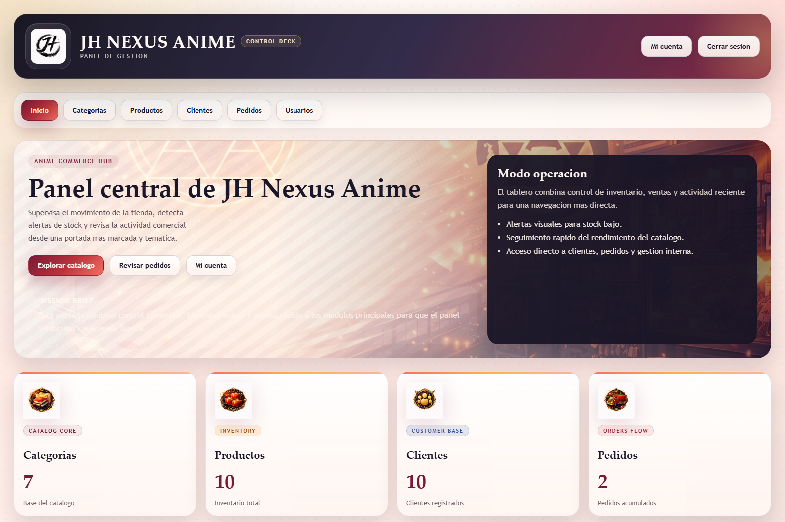

# Documentacion del Proyecto JH Nexus Anime

## 1. Introduccion

JH Nexus Anime es una aplicacion web de gestion orientada a una tienda de productos anime. El proyecto esta construido con Java 8, Spring Boot, Spring MVC, JPA/Hibernate, JSP y MySQL.

El objetivo principal es centralizar la gestion de:

- categorias
- productos
- clientes
- pedidos
- usuarios y roles

Ademas, el proyecto incluye mejoras de usabilidad, seguridad y administracion interna que lo acercan a un entorno mas realista que un CRUD basico.

## 2. Objetivo del Proyecto

Este proyecto busca demostrar:

- arquitectura por capas
- uso de Spring Boot con MVC y JSP
- persistencia con JPA/Hibernate
- seguridad con autenticacion y autorizacion por roles
- gestion de catalogo y pedidos
- validaciones, manejo de errores y mejora progresiva del codigo

## 3. Tecnologias Utilizadas

- Java 8
- Spring Boot 2.7.18
- Spring MVC
- Spring Security
- JPA / Hibernate
- MySQL
- JSP + JSTL
- Maven
- Visual Studio Code

## 4. Arquitectura General

La aplicacion sigue una arquitectura por capas:

- `controller`: recibe peticiones web y coordina la respuesta
- `service`: contiene la logica de negocio
- `dao`: encapsula acceso a base de datos y consultas JPA
- `model`: entidades, formularios y modelos auxiliares
- `config`: configuracion de seguridad, bootstrap y manejo global
- `util`: utilidades de apoyo

## 5. Estructura de Carpetas

```text
src/
  main/
    java/com/otakucenter/
      config/
      controller/
      dao/
      exception/
      model/
      service/
      util/
    resources/
    webapp/
      WEB-INF/views/
      assets/
  test/
    java/com/otakucenter/
```

## 6. Modelo Funcional

Los modulos principales del sistema son:

- Categorias: organizan el catalogo por familias de productos
- Productos: gestion de stock, precio, categoria y auditoria basica
- Clientes: gestion de datos de clientes
- Pedidos: creacion, consulta y control del flujo de compra
- Usuarios: administracion de acceso, roles, estado y bitacora

## 7. Seguridad, Usuarios y Roles

El sistema dispone de autenticacion con formulario de login y autorizacion por roles.

Roles definidos:

- `ADMIN`: acceso completo y gestion de usuarios
- `DELEGADO`: operativa sobre catalogo, clientes y pedidos
- `USER`: acceso limitado de consulta

Tambien se incluyen:

- cuentas bloqueadas o activas
- bitacora administrativa
- registro de ultimo acceso
- vista `Mi cuenta`

## 8. Gestion de Catalogo

La gestion de catalogo cubre:

- creacion y edicion de categorias
- alta y mantenimiento de productos
- busqueda, ordenacion y paginacion
- detalle individual de producto y categoria
- exportacion CSV

## 9. Gestion de Clientes

La gestion de clientes permite:

- alta, edicion y eliminacion
- busqueda y ordenacion
- paginacion
- ficha de detalle
- auditoria simple

## 10. Gestion de Pedidos

La gestion de pedidos incluye:

- creacion y edicion de pedidos
- validacion de lineas y stock
- detalle de pedido
- estados de pedido
- exportacion CSV

Se aplicaron mejoras tecnicas para reforzar:

- validacion del formulario
- borrados por `POST`
- control de stock con mejor aislamiento

## 11. Dashboard e Indicadores

La pagina principal actua como dashboard y resume:

- categorias
- productos
- clientes
- pedidos
- ventas acumuladas
- ticket medio
- pedidos pendientes, enviados y entregados

## 12. Validaciones y Manejo de Errores

El proyecto incorpora:

- validaciones JSR-303
- validaciones de negocio en servicios
- excepciones de dominio
- `ControllerAdvice` para centralizar parte del manejo de errores

Esto permite mostrar mensajes mas coherentes al usuario y reducir `try/catch` repetidos en controladores.

## 13. Exportacion y Utilidades

Entre las utilidades del proyecto se encuentran:

- exportacion de listados a CSV
- bitacora administrativa
- auditoria simple
- normalizacion de texto para datos demo

## 14. Decisiones Tecnicas y Refactors Realizados

Durante la evolucion del proyecto se aplicaron varias mejoras:

- separacion por perfiles de configuracion
- eliminacion de sincronizacion viva desde fichero de usuarios
- borrados por `POST` en lugar de `GET`
- capa de excepciones de dominio
- mejoras de paginacion y conteo desde base de datos
- encapsulacion parcial de compatibilidad legacy en pedidos
- primeros tests unitarios

## 15. Problemas Encontrados y Soluciones Aplicadas

Ejemplos de incidencias resueltas:

- mensajes de login poco precisos para cuentas bloqueadas
- uso de `GET` para operaciones destructivas
- trabajo excesivo en memoria para listados y dashboard
- error de version nula en productos al introducir `@Version`
- normalizacion defectuosa de texto en datos demo

## 16. Mejoras Futuras

Líneas de mejora razonables:

- eliminar completamente la compatibilidad legacy en pedidos
- añadir tests de integracion para login, usuarios y flujo de pedido
- introducir migraciones de base de datos con Flyway o Liquibase
- seguir separando logica de presentacion de entidades

## 17. Anexo Visual

Las siguientes capturas recomendadas documentan el funcionamiento del sistema:

1. Login normal
2. Login con usuario bloqueado
3. Dashboard principal
4. Listado de categorias
5. Formulario de categoria
6. Listado de productos
7. Detalle de producto
8. Validacion en formulario de producto o pedido
9. Listado de clientes
10. Detalle de cliente
11. Listado de pedidos
12. Detalle de pedido
13. Panel de usuarios
14. Mi cuenta
15. Bitacora administrativa
16. Mensaje de error controlado

## 18. Guion Para Insertar Capturas

Usa esta convención:

- `docs/img/01-login.png`
- `docs/img/02-login-usuario-bloqueado.png`
- `docs/img/03-dashboard.png`
- `docs/img/04-categorias-lista.png`
- `docs/img/05-categorias-formulario.png`
- `docs/img/06-productos-lista.png`
- `docs/img/07-producto-detalle.png`
- `docs/img/08-validacion-formulario.png`
- `docs/img/09-clientes-lista.png`
- `docs/img/10-cliente-detalle.png`
- `docs/img/11-pedidos-lista.png`
- `docs/img/12-pedido-detalle.png`
- `docs/img/13-usuarios-panel.png`
- `docs/img/14-mi-cuenta.png`
- `docs/img/15-bitacora-admin.png`
- `docs/img/16-error-controlado.png`

Ejemplo de insercion en Markdown:

```md
### Figura 3. Dashboard principal



La pantalla principal resume el estado general del sistema, mostrando modulos clave y metricas operativas.
```
