# Memoria del Proyecto JH Nexus Anime

## 1. Portada

**Proyecto:** JH Nexus Anime  
**Tipo de aplicacion:** Sistema web de gestion interna  
**Tecnologias principales:** Java 8, Spring Boot, Spring MVC, JPA/Hibernate, JSP, MySQL  
**Autor:** Jorge  
**Fecha:** 2026

## 2. Introduccion

JH Nexus Anime es una aplicacion web de gestion orientada a una tienda de productos anime. El proyecto nace con la idea de ofrecer una herramienta interna para controlar el catalogo, los clientes, los pedidos y la gestion de usuarios desde una unica interfaz.

La aplicacion se ha desarrollado como un sistema de gestion clasico de entorno empresarial pequeno o mediano, con una interfaz web orientada a operativa diaria y administracion interna. Aunque parte de una base CRUD tradicional, durante el desarrollo se ha ampliado con seguridad por roles, dashboard, exportacion CSV, auditoria y mejoras de usabilidad.

## 3. Objetivo del Proyecto

El objetivo principal del proyecto es construir una aplicacion funcional y mantenible que permita:

- gestionar categorias y productos del catalogo
- controlar clientes y pedidos
- administrar usuarios con diferentes permisos
- visualizar informacion resumida del estado del negocio
- ofrecer una base tecnica clara sobre arquitectura por capas, persistencia y seguridad

Ademas, se ha buscado que el resultado no sea solo una practica academica minima, sino una version mas cercana a una aplicacion real de uso interno.

## 4. Publico Objetivo

La aplicacion esta dirigida a personal interno de la tienda. No esta pensada como una tienda publica para clientes finales, sino como una herramienta de gestion para trabajadores.

Perfiles de uso:

- **Administrador**
  Responsable de la gestion total del sistema. Puede acceder a usuarios, cambiar roles, bloquear o desbloquear cuentas, modificar contrasenas, consultar la bitacora y operar sobre todos los modulos.

- **Delegado**
  Perfil operativo. Puede gestionar productos, clientes y pedidos, pero no tiene acceso completo a la administracion de usuarios ni a determinadas operaciones reservadas al administrador.

- **Usuario**
  Perfil de consulta. Puede acceder a la aplicacion con permisos mas limitados, enfocados a visualizacion y control basico.

En un contexto real, estos perfiles encajan con:

- encargado de tienda
- trabajador de inventario y pedidos
- personal de consulta o apoyo administrativo

## 5. Alcance Funcional

La aplicacion cubre los siguientes modulos:

- categorias
- productos
- clientes
- pedidos
- usuarios
- dashboard principal

Tambien incluye funcionalidades complementarias:

- autenticacion
- autorizacion por roles
- bitacora administrativa
- auditoria simple
- exportacion de datos a CSV
- paginacion y ordenacion de listados

## 6. Tecnologias Utilizadas

- Java 8
- Spring Boot 2.7.18
- Spring MVC
- Spring Security
- JPA / Hibernate
- MySQL
- JSP + JSTL
- Maven
- Visual Studio Code

Estas tecnologias se eligieron por su valor didactico y por permitir desarrollar una aplicacion web completa en arquitectura tradicional Java.

## 7. Arquitectura del Proyecto

El sistema sigue una arquitectura por capas.

### 7.1 Capa Controller

Recibe las peticiones web, prepara datos para las vistas y coordina el flujo general de la aplicacion.

### 7.2 Capa Service

Contiene la logica de negocio principal, como validaciones, reglas operativas, control de stock, gestion de usuarios y calculos de negocio.

### 7.3 Capa DAO

Encapsula el acceso a base de datos y las consultas JPA. Durante la evolucion del proyecto, esta capa se reforzo para hacer paginacion y ordenacion reales desde la base de datos.

### 7.4 Capa Model

Incluye entidades persistentes, formularios de entrada y modelos auxiliares utilizados por el sistema.

### 7.5 Capa Config

Reune configuracion de seguridad, bootstrap de datos de demo, beans y manejo global de errores.

## 8. Funcionalidades Principales

### 8.1 Gestion de Categorias

Permite:

- crear categorias
- editar categorias
- eliminar categorias sin productos asociados
- listar categorias con paginacion
- buscar por nombre
- ordenar por id y nombre
- exportar categorias a CSV

### 8.2 Gestion de Productos

Permite:

- dar de alta nuevos productos
- editar datos del inventario
- asignar categoria
- controlar precio y stock
- filtrar por stock bajo
- ordenar por id, nombre, descripcion, precio, stock y categoria
- consultar detalle del producto
- exportar productos a CSV

### 8.3 Gestion de Clientes

Permite:

- crear clientes
- editar clientes
- eliminar clientes sin pedidos asociados
- buscar por nombre, apellidos, email o telefono
- ordenar por distintas columnas
- consultar detalle individual
- exportar clientes a CSV

### 8.4 Gestion de Pedidos

Permite:

- crear pedidos con varias lineas
- editar pedidos
- controlar estado del pedido
- validar cliente, lineas y cantidades
- actualizar stock al guardar o eliminar
- consultar detalle del pedido
- ordenar pedidos por id, fecha, cliente, detalle, unidades, estado y total
- exportar pedidos a CSV

### 8.5 Gestion de Usuarios

Permite:

- crear usuarios
- bloquear y desbloquear cuentas
- cambiar roles
- cambiar contrasenas
- eliminar usuarios no protegidos
- consultar ultimo acceso
- ver bitacora administrativa

## 9. Seguridad y Control de Acceso

La aplicacion incorpora autenticacion mediante formulario de login y autorizacion basada en roles.

Aspectos principales:

- pantalla de login propia
- mensaje especifico para usuario bloqueado
- control por rol sobre rutas y acciones
- proteccion CSRF en formularios
- bloqueo de acciones sensibles a usuarios no autorizados

Tambien se aplicaron mejoras durante el refactor:

- eliminacion de borrados por `GET`
- paso a operaciones sensibles por `POST`
- separacion basica de perfiles de configuracion
- reduccion del uso del fichero de usuarios como fuente operativa viva

## 10. Dashboard Principal

La pantalla inicial actua como resumen operativo del sistema. En ella se muestran indicadores visuales de:

- categorias
- productos
- clientes
- pedidos
- ventas acumuladas
- ticket medio
- estados de pedidos

El objetivo del dashboard es ofrecer una vista rapida del estado general del negocio al entrar en la aplicacion.

## 11. Validaciones y Manejo de Errores

El proyecto incluye validaciones tanto a nivel de formulario como de negocio.

Ejemplos:

- campos obligatorios
- cantidades minimas
- stock suficiente
- roles validos
- usuarios duplicados
- restricciones para eliminar entidades relacionadas

En la parte de errores se introdujo una capa de excepciones de dominio y un manejo global para evitar repeticion innecesaria de `try/catch` en controladores.

## 12. Mejoras Aplicadas Durante el Desarrollo

Durante la evolucion del proyecto se aplicaron mejoras relevantes:

- branding visual propio de la tienda
- login con roles reales
- panel de usuarios
- bitacora administrativa
- auditoria simple
- exportacion CSV
- listados con paginacion real
- ordenacion por cabeceras de tabla
- mejora de validaciones de formularios
- correccion de errores de configuracion y persistencia
- primeros tests automatizados
- generacion automatica de capturas para documentacion

Estas mejoras hacen que el proyecto haya superado el alcance de un CRUD basico.

## 13. Problemas Encontrados y Soluciones

Algunos problemas detectados durante el desarrollo fueron:

- mensajes poco precisos en login para usuarios bloqueados
- configuracion inicial demasiado acoplada a desarrollo local
- trabajo excesivo en memoria para filtros y paginacion
- eliminaciones por `GET`
- riesgo de incoherencia en stock
- problema de version nula al introducir control de concurrencia en productos
- capturas automaticas que perdian sesion y guardaban login en lugar de vistas reales

Para cada uno de estos puntos se aplicaron refactors o correcciones concretas.

## 14. Mejoras Futuras

Posibles mejoras posteriores:

- eliminar definitivamente la compatibilidad legacy restante en pedidos
- ampliar la cobertura de tests de integracion
- introducir migraciones de base de datos con Flyway o Liquibase
- seguir separando modelos de vista de entidades persistentes
- evolucionar a una API REST si en el futuro se necesitara desacoplar frontend y backend

## 15. Conclusiones

JH Nexus Anime es una aplicacion de gestion interna que cumple correctamente con su finalidad principal: centralizar las operaciones basicas de una tienda anime desde una interfaz unificada y con roles diferenciados.

El proyecto demuestra conocimientos practicos de:

- arquitectura por capas
- desarrollo web con Spring Boot
- persistencia con JPA/Hibernate
- seguridad con Spring Security
- refactorizacion y mejora progresiva

Ademas, se ha buscado cuidar tanto el aspecto funcional como el visual y documental del sistema, con una evolucion progresiva hacia una solucion mas completa y defendible tecnicamente.

## 16. Anexo Visual

### Figura 1. Login

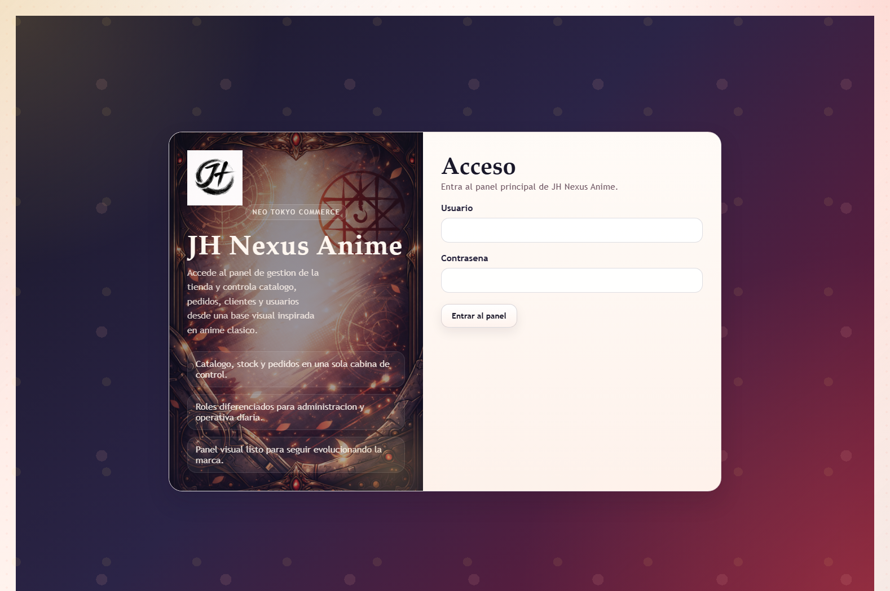

Pantalla de acceso principal al sistema.

### Figura 2. Login con usuario bloqueado

Ejemplo de mensaje mostrado cuando una cuenta no esta habilitada para acceder.

### Figura 3. Dashboard principal

Pantalla inicial con resumen visual de modulos e indicadores operativos.

### Figura 4. Listado de categorias

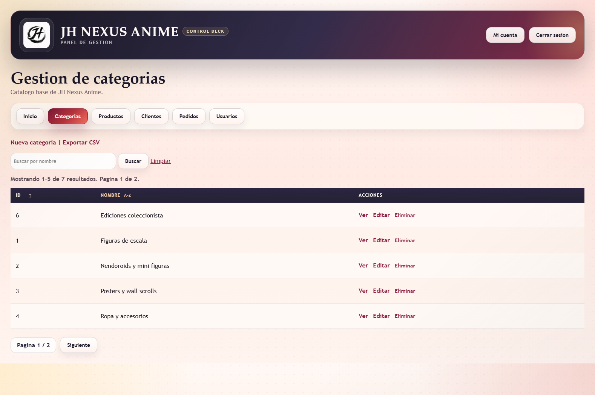

Vista general del modulo de categorias con busqueda, paginacion y ordenacion.

### Figura 5. Formulario de categoria

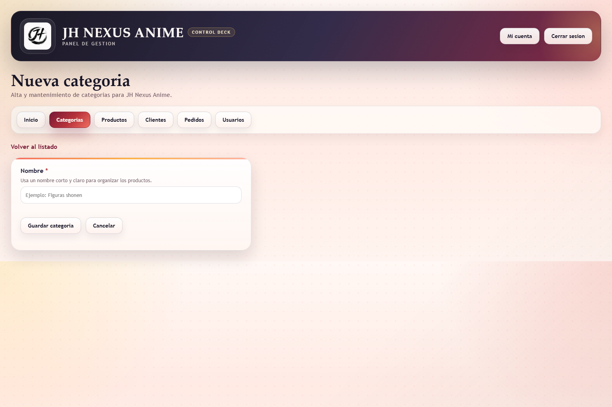

Pantalla de alta o edicion de categorias.

### Figura 6. Listado de productos

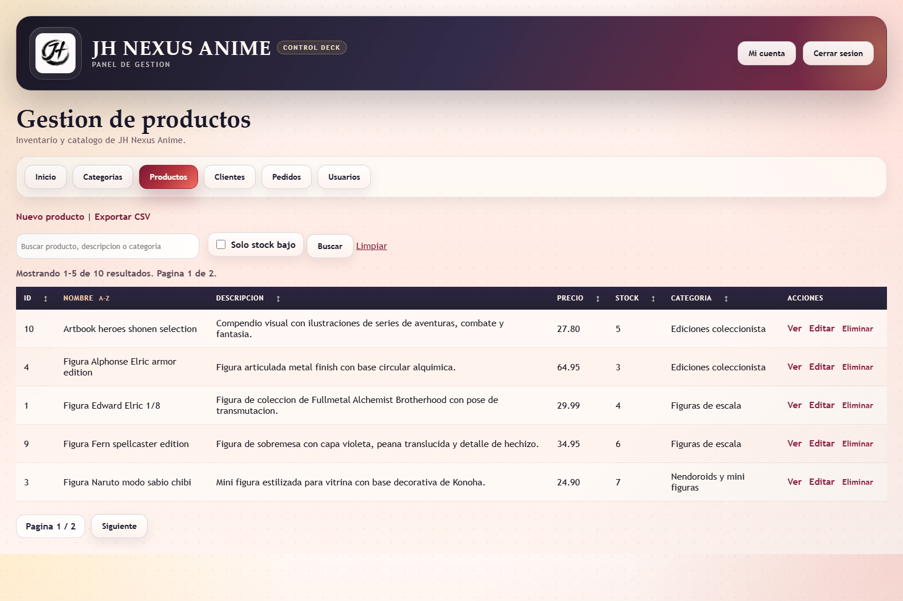

Vista del catalogo con filtros, control de stock y ordenacion por columnas.

### Figura 7. Detalle de producto

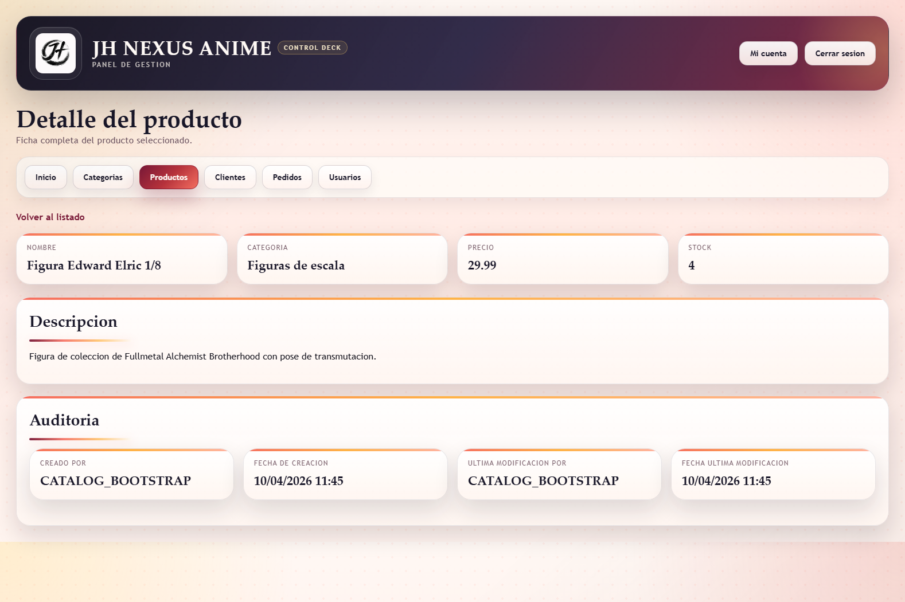

Ficha individual de producto con informacion operativa y auditoria simple.

### Figura 8. Validacion de formulario

Ejemplo de validacion visual en el formulario de pedidos.

### Figura 9. Listado de clientes

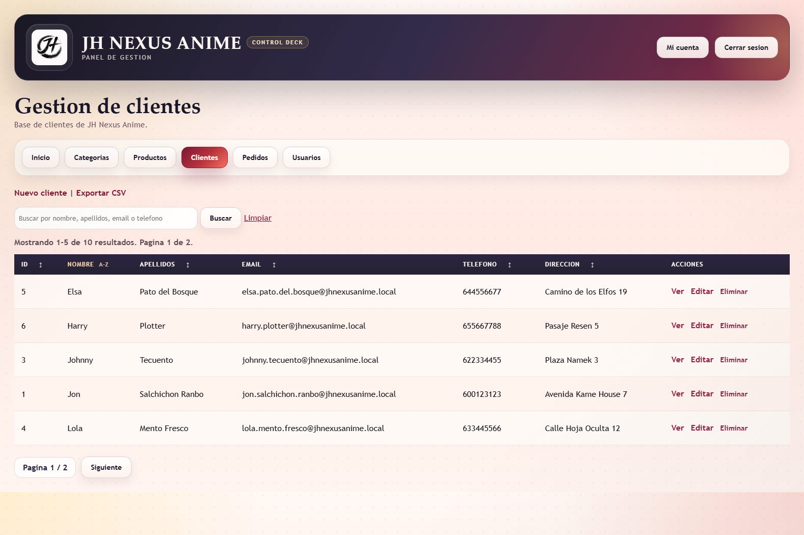

Pantalla principal del modulo de clientes con busqueda, paginacion y ordenacion.

### Figura 10. Detalle de cliente

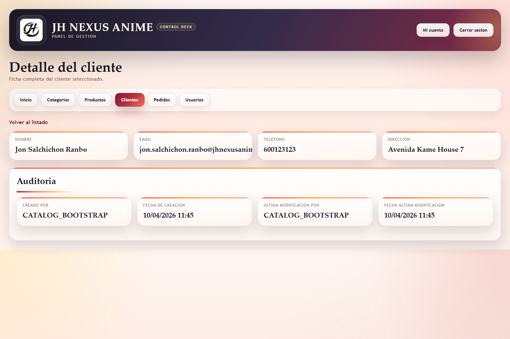

Vista individual del cliente con datos principales y auditoria.

### Figura 11. Listado de pedidos

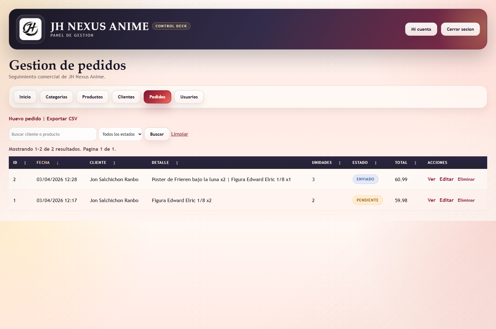

Pantalla principal del modulo de pedidos con filtros y ordenacion de columnas.

### Figura 12. Detalle de pedido

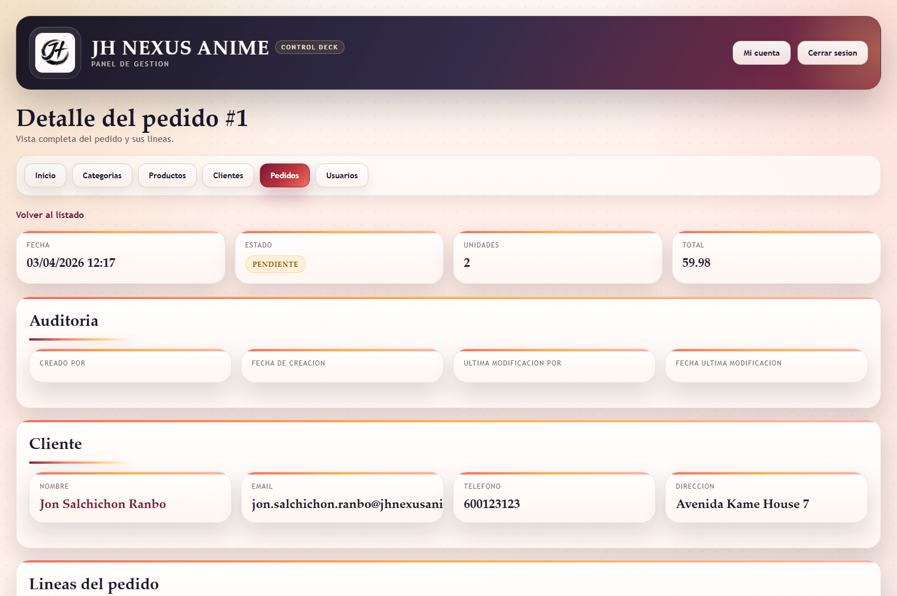

Vista completa del pedido con cliente, lineas, estado, total y auditoria.

### Figura 13. Panel de usuarios

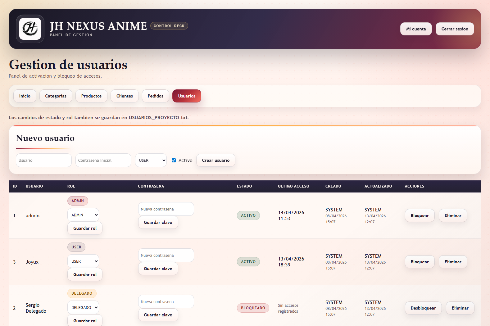

Pantalla de administracion de usuarios, roles, estados y acciones de gestion.

### Figura 14. Mi cuenta

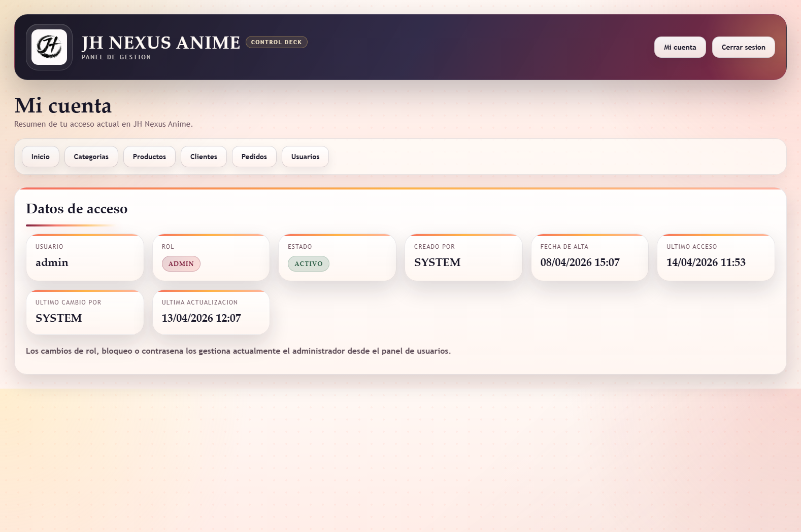

Vista personal del usuario autenticado con su informacion principal.

### Figura 15. Bitacora administrativa

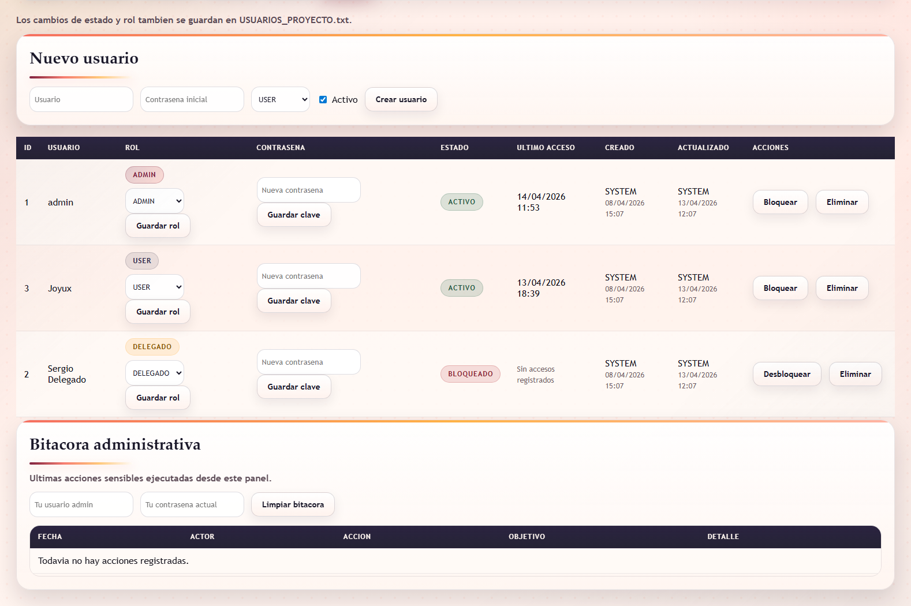

Registro visual de acciones administrativas realizadas sobre cuentas y seguridad.

### Figura 16. Error controlado

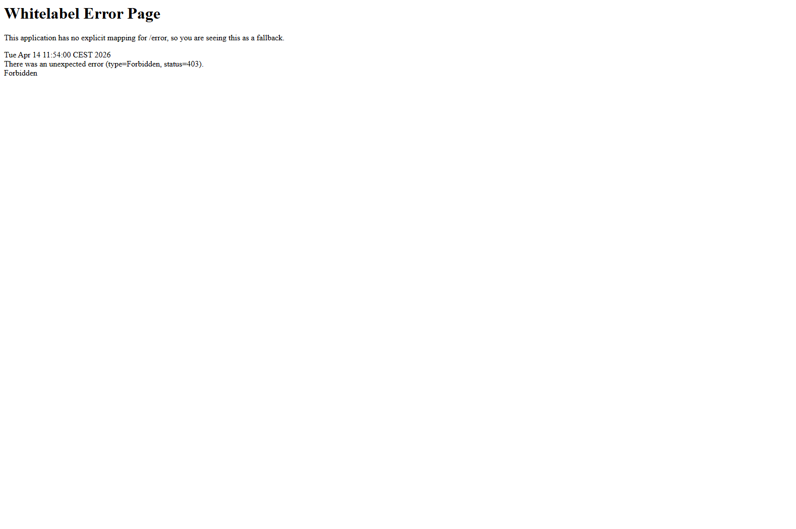

Ejemplo de acceso restringido o flujo controlado ante una accion no permitida.
